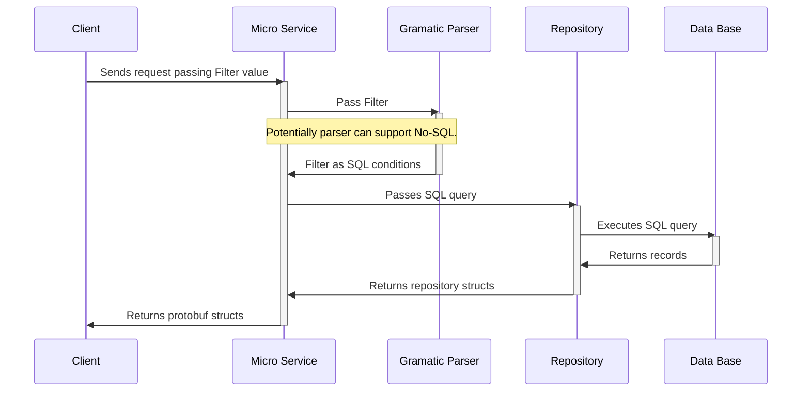
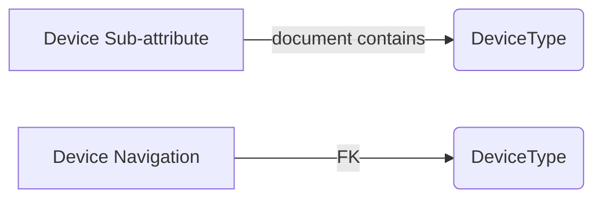

# Evaluation of current filtering languages

*This document use Mermaid graphs. A supporting browser plugin is required.
This [link](https://chrome.google.com/webstore/detail/mermaid-diagrams/phfcghedmopjadpojhmmaffjmfiakfil/related?hl=en-US)
provides a Chrome Extension in order to view the graphs.*

## Requirements
 
To respond to the open question about filtering in requirement FF-007 
* [FF-007: List view of target devices](https://github.com/vertiv-it-systems/firefly-features/issues/5) 

## Responsibilities

* Provides a standard grammatic that will be used in filter field for Device list view  and potentially any other service that queries DB
* This grammatic may not be used by no-DB services, because of the querying support limitations.

## Interactions
*Filter* is passed by *Client* to *Micro Service*, *Micro Service* will call the Grammatic parser to translate filter conditions to SQL conditions.  Once the *Filter* is translated *Micro Service* can use *Repository* to execute the query in the *DB*. Also, many parsers can translate to SQL and  No-SQL queries too. 

### Send request with filter field 

## Query language
Query Language allows the web client to hide the underlying storage query, with and standard way to retrieve data regardless of the way data is stored. 

There are many query languages that are widely used in Web development we will evaluate 6 more popularly:
- FIQL
- RQL
- OData
- GData
- GraphQL

### Feed Item Query Language - FIQL
Developed by  Internet Engineering Task Force (IETF) Once of the oldest query languages(2007), IETF replaced this language with RQL but still supported by RQL as a grammar alternative.

License:https://tools.ietf.org/html/bcp78 (BCP-78)

Specification: https://tools.ietf.org/html/draft-nottingham-atompub-fiql-00

Operation|Operator| Example
--|--|--
|Equal to |  `==` |`erName=="bjensen"`
|Not equal to |  `!=`|`erName!="bjensen"`
|Less than |  `=lt=` |`count=lt=1`
|Less than or equal to |  `=le=` |`count=le=1`
|Greater than operator |  `=gt=`  |`date=gt="2011-05-13T04:42:34Z"`
|Greater than or equal to |  `=ge=`  |`date=ge="2011-05-13T04:42:34Z"`
|In * |  `=in=`|
|Not in *|  `=out=`|
**Not included in an original draft, but later added in some libraries*

### Resource Query Languages - RQL

Also developed by Internet Engineering Task Force (IETF) around 2012 to replace the old FIQL, last updated in 2015 oriented as no-SQL ready, arguably the most popular and widely used protocol for Rest development. 

License: https://trustee.ietf.org/license-info/IETF-TLP-5.htm 

Specification: https://tools.ietf.org/html/draft-ietf-scim-api-12
It tries to solve some of the original limitations of FIQL overall in the API support like no-SQL schema, pagination, and RESTFUL operations, and filtering is extended with additional operators.

Operation|Operator| Example
--|--|--
|Equal to |  `eq` | `erName eq "bjensen"`
|Less than |  `lt` |`meta.lastModified lt "2011-05-13T04:42:34Z"`
|Less than or equal to |  `le` |`meta.lastModified le "2011-05-13T04:42:34Z"`
|Greater than operator |  `gt`  |`meta.lastModified gt "2011-05-13T04:42:34Z"`
|Greater than or equal to |  `ge`  |`meta.lastModified ge "2011-05-13T04:42:34Z"`
|Contains* |  `co`|`emails co "example.com" or emails co "example.org"`
|Starts with* |  `sw`|`userName sw "J"`
|Present (has value)* |  `pr`|`title pr and userType eq "Employee"`
|Logical and |  `and`|`title pr and userType eq "Employee"`
|Logical or |  `or`|`title pr or userType eq "Intern"`
|precedence grouping * |  `()`|`userType eq "Employee" and (emails.type eq "work")`
|complex attribute grouping * |  `[]`|`user.address[0]`
|sub-attribute* |  `.`|`user.address.city`
**Not present in in FIQL*

#### Pros:
-	Simple and flexible
-	Tested to work well with NoSQL queries.
-	Lot of documentation, forum, etc.
-	Widely used, there are many libraries Server/Client side implementing RQL

#### Cons:
-	Language supports different notations, in our example, these 3 queries are the same but written in different formats
```
foo=3&price=lt=10 //Legacy FIQL grammar
eq(foo,3)&lt(price,10) //RQL grammar
and(eq(foo,3),lt(price,10)) // normalized form (function like) grammar
```
But we can choose one grammar.
-	Originally designed to NoSQL DB, but can be adapted to RQL with some limitations like sub-attributes.
-	While there are libraries in almost all languages GoLang implementation is not that many, and most translate only to NonSql, other types of the store need to be implemented.


### Open Data Protocol (OData)

Developed by Microsoft in 2007, version 4.02005 but standardized by OASIS in 2017 OData was approved as ISO/IEC Standard, last version 4.01 was released in 2020.

License: https://www.oasis-open.org/policies-guidelines/ipr

Specification: http://docs.oasis-open.org/odata/odata/v4.01/odata-v4.01-part1-protocol.html
 (2020)

Operation|Operator| Example
--|--|--
Equal|	`eq`|	`Address/City eq 'Redmond'`
Not equal|	`ne`	|`Address/City ne 'London'`
Greater than|	`gt`	|`Price gt 20`
Greater than or equal	|`ge`	|`Price ge 10`
Less than|	`lt`	|`Price lt 20`
Less than or equal	|`le`	|`Price le 100`
Has flags	|`has`	|`Style has Sales.Color'Yellow'`
Is a member of |`in`	|`Address/City in ('Redmond', 'London')`
Logical and	|`and`	|`Price le 200 and Price gt 3.5`
Logical or	|`or`	|`Price le 3.5 or Price gt 200`
Logical negation	|`not`	|`not endswith(Description,'milk')`
Addition	|`add`	|`Price add 5 gt 10`
Subtraction	|`sub`	|`Price sub 5 gt 10`
Multiplication	|`mul`	|`Price mul 2 gt 2000`
Division	|`div`	|`Price div 2 gt 4`
Decimal Division	|`divby`	|`Price divby 2 gt 3.5`
Modulo	|`mod`	|`Price mod 2 eq 0`
Precedence grouping	|`( )`	|`(Price sub 5) gt 10`

Also provides more than functions that cover Collection, String, Date and Time, Arithmetic, Type, Geo, and Conditional Functions, see specification for more detail.  

#### Pros:
-	Is an ISO standard
-	API is very complex, but filtering is simple enough 
-	large list of functions supported from date time to geo-spacial
-	Aggregation is supported as an extension of the language
-	Not limited to relational DB
-	Also many libraries implementing in many languages including Python and C but the GoLang support seems limited

#### Cons:
-	While we can limit the list of functions supported there are some that may be difficult to implement.
-	Not as widely used as RQL
-	there is no official GoLang library but there is some third party that is in the development process, most likely will require to modify one of those.

### GData

Developed by Google as a simple way to consume data from the internet. Lately, many Google Services are replacing this API with a newer API, not sure if the new API still being called GData, in this evaluation we are taking Google Analytics as an example

License: https://creativecommons.org/licenses/by/4.0/

Specification https://developers.google.com/gdata/docs/2.0/reference#QueryRequests (2012)

Google Analytics V3(GData): https://developers.google.com/analytics/devguides/reporting/core/v3/reference#filterOperators
Google Analytics V4(New API): 
https://developers.google.com/analytics/devguides/reporting/core/v4/rest/v4/reports/batchGet#operator

#### Operators 
Not all Google services implement GData, Google provides a list of compatible services, we took one [Analytics Reporting API V3](https://developers.google.com/analytics/devguides/reporting/core/v3/reference#filterOperators) to base this comparison
Numeric/Time
Operation|Operator| Example
--|--|--
Equals	|`==`	|`timeOnPage==10`
Does not equal	|`!=`	|`timeOnPage!=10`
Greater than	|`>`	|`timeOnPage>10`
Less than	|`<`	|`timeOnPage<10`
Greater than or equal to	|`>=`	|`timeOnPage>=10`
Less than or equal to	|`<=`	|`timeOnPage<=10`

String/Text operations

Operation|Operator| Example
--|--|--
Exact match	|`==`	|`city==Irvine`
Does not match	|`!=`	|`city!=Irvine`
Contains substring	|`=@`	|`city=@York`
Does not contain substring	|`!@`	|`city!@York`
Contains a match for the regular expression	|`=~`	|`city=~%5ENew.*` 
Does not match regular expression	|`!~`	|`city!~%5ENew.*`

**%5E is the URL encoded form of the ^ character that anchors a pattern to the beginning of the string.*
Logic
Operation|Operator| Example
--|--|--
And	|`;`	|`country==United%20States;browser==Firefox`
Or	|`,`	|`country==United%20States,browser==Firefox`


#### Pros:
-	Very simple
-	Documentation is reduced ad not well structured.
-	Google implements client in many languages including Python, but the server-side is not clear
-	Regular expressions operators improve the filter allowing complex filters

#### Cons:
-	Seems not popular outside Google and is changing to a new API in Google
-	New version Api seems oriented to support POST queries and not GET queries
-	No GoGlang or C client library
-	Regular expressions required to be passed by the client, so someone needs to generate the Regular expressions, the client, or the final user, last option will make API very hard for the final user.
-	Time range is not handled by the filter instead GData defines 2 specific fields for that start-date and end_date
```
  &start-date=7daysAgo
  &end-date=yesterday
```

### GraphQL

Developed by Facebook and released in 2015 hosted by GraphQL Foundation now.

License: not sure, seems Linux

Specification: http://spec.graphql.org/June2018/ (2018)

#### Examples:
```
{  user(id: 4) {
    name
  }}

query withFragments {
  user(id: 4) {
    friends(first: 10) {
      ...friendFields
    }
    mutualFriends(first: 10) {
      ...friendFields
    }
  }
}
fragment friendFields on User {
  id
  name
  profilePic(size: 50)
}
```
#### Pros:
-	Query by example syntax makes it very easy to use
-	Has nice features like Fragments, Alias, Variables, mutations, etc.
-	Has support for GoLang, Python, and C++
-	Good documentation, examples forums, etc.
#### Cons:
-	Is “Query by Example” that means potentially we need to pass a large amount of data in the request what makes it more suitable for POST than GET
-	While it has some nice features is not clear how to support a basic operation like >, <, COUNT, MIN, MAX, etc.

### Advanced features
There are some advanced features required for device service model

#### Navigation and sub-attribute
Navigation allows us to retrieve data of one entity by navigation from another entity, by example in the device model we can retrieve the device type data from a specific device, or list the devices from a specific device type, as you can see navigation can be done in both ways.
Sub-attribute, sub-property, or nested property, in, another way, is a form of Document Navigation where an attribute is an embedded object that also has attributes (JSON-like). In our case, if Device Type will be Device's attribute then Device Type attributes will become sub-attributes of Device. 


##### FIQL
FIQL, as the oldest language evaluated, does not support navigation but the new version RQL does.

##### RQL
RQL supports sub-property navigation with the dot "." operator. By example, this will return all departments where the manager lives in Florida 
```
department.manager.address.state eq 'Florida'
```
the specification defines Attribute Path in URI but I did not find any library with a concrete example of how to use it. 

##### OData
OData supports both navigation and sub-property. Navigation is supported with URI request
```
GET http://host/service/Suppliers(MainSupplier)/Addresses/0
```
also at the filter level with the `/` operation. For example, this query will return all Categories with less than 10 products
```
GET http://host/service/Categories?$filter=Products/$count lt 10
```
 in Odata version 4.0 Sub-property required a combination of $expand and $filter but in 4.01 it simplifies the use with the operator "/" similar to navigation
```
$filter=DeviceType/Name eq 'some text'
```  
##### Gdata
Gdata supports both navigation and sub-property. Navigation is supported with URI request

Gdata implementation of sub-property is similar to Odata one
```
"Use  `a/b`  to select a field b that is nested within field a; use  `a/b/c`  to select a field c nested within b."
```
##### GraphQL
Because GraphQL is a JSON-like query is easy to supports both sub-property, just implement a query with the sub-property value. 
```
{
  hero(episode: $episode) {
    name
    heroFriends: friends {
      id
      name
    }
  }
}
```
Navigation in another hand can be implemented as fragment's union 
```
union SearchResult = Photo | Person

type Person {
  name: String
  age: Int
}

type Photo {
  height: Int
  width: Int
}

type SearchQuery {
  firstSearchResult: SearchResult
}
```
## Conclusion
Each protocol has its pros and cons we need to choose the one that is better for our requirements and can allow us to grow in the future, by example

- IFQL and RQL are very popular and well documented but most likely we will find limitations in the protocol, also is very hard that these protocols get an update in the future.

- OData is very complex and tries to cover every little need but because there is no Golang library we will need to modify existing libraries. Being a new ISO standard may help the standard to become more popular but that is not sure.

- GData maybe is the logic option but based on changes in version V3 to V4 seems GData is choosing an approach more similar to GraphQL asking new developers to stop using V3.

- GraphQL this querying approach is more document querying/manipulation has a lot of potential but not sure it will be useful for us at this stage (retrieve data from SQL DB), but maybe in the long future, we way ended using GraphQL or GData V4 or similar for document manipulation.


